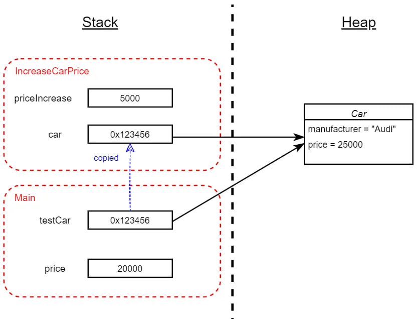

# Representación de Objetos en Memoria
# C#
Las variables de C# se almacenan en el Stack o en el Heap, dependiendo de si la variable es de tipo referencia o valor, y del contexto en el que se declara la variable.

- Las variables locales (es decir, aquellas que se declaran dentro de los métodos) se almacenan en el Stack. Esto significa que sus valores se almacenan en el Stack. En el caso de variables locales de tipo referencia, tienen referencias almacenadas en el Stack, mientras que las variables locales de tipo valor tienen valores reales almacenados en el Heap.

- Los objetos a los que apuntan las variables de tipo referencia siempre se almacenan en el Heap.

- Las variables de instancia que forman parte de una instancia de tipo referencia (por ejemplo, un campo en una clase) se almacenan en el Heap junto con el objeto mismo.

- Las variables de instancia que forman parte de una instancia de tipo valor se almacenan en el mismo contexto que la variable que declara el tipo valor. Esto significa que una variable de una estructura declarada en un método se almacenará en el Stack, mientras que una variable de una estructura declarada dentro de una clase (es decir, un campo de la clase) se almacenará en el Heap.

**Nota:** La representación exacta en memoria puede depender de la implementación específica del runtime de C# (como el Common Language Runtime - CLR). Sin embargo, podemos proporcionar una representación conceptual gráfica de cómo podrían almacenarse los datos y métodos en memoria.

#### Ejemplo de una clase que no hereda de ninguna otra:
```csharp
public class Car
{
    public string manufacturer;
    public int price;

    public Car(string manufacturer, int price)
    {
        this.manufacturer = manufacturer;
        this.price = price;
    }
}

static void Main(string[] args)
{
    int price = 20000;
    Car testCar = new Car("Audi", price); 
}
```


#### Ejemplo2:
Definiremos un tipo de estructura NumberOfSeatsAndDoors y modificaremos la clase Car para que contenga un campo de este tipo.

```csharp
public class Car
{
    public string manufacturer;
    public int price;
    public NumberOfSeatsAndDoors numberOfSeatsAndDoors;

    public Car(string manufacturer, int price, NumberOfSeatsAndDoors numberOfSeatsAndDoors)
    {
        this.manufacturer = manufacturer;
        this.price = price;
        this.numberOfSeatsAndDoors = numberOfSeatsAndDoors;
    }
}

public struct NumberOfSeatsAndDoors
{
    public int numSeats;
    public int numDoors;

    public NumberOfSeatsAndDoors(int numSeats, int numDoors)
    {
        this.numSeats = numSeats;
        this.numDoors = numDoors;
    }
}
class Program
{
    static void Main(string[] args)
    {
        NumberOfSeatsAndDoors x = new NumberOfSeatsAndDoors(5, 4);
        Car testCar1 = new Car("Audi", 20000, x);
        Car testCar2 = testCar1;
    }
}
```


#### Ejemplo3:
Agregaremos un método estático a la clase Program y lo usaremos en el método. La clase Car será la del primer ejemplo para mantener las cosas simples.

```csharp
public class Car
{
    public string manufacturer;
    public int price;

    public Car(string manufacturer, int price)
    {
        this.manufacturer = manufacturer;
        this.price = price;
    }
}
class Program
{
   static void Main(string[] args)
    {
        int price = 20000;
        Car testCar = new Car("Audi", price);
        InreaseCarPrice(testCar, 5000);
    }

    static void IncreaseCarPrice(Car car, int priceIncrease)
    {
        car.price += priceIncrease;
    }
}
```


#### Ejemplo de objeto perteneciente a una clase que muestre una herencia simple
    
```csharp
using System;

// Definición de la clase base
class Animal
{
    public string Nombre { get; set; }

    // Constructor de la clase base
    public Animal(string nombre)
    {
        Nombre = nombre;
    }
}

// Definición de la clase derivada
class Perro : Animal
{
    public string Raza { get; set; }

    // Constructor de la clase derivada
    public Perro(string nombre, string raza) : base(nombre)
    {
        Raza = raza;
    }
}

class Program
{
    static void Main()
    {
        // Crear un objeto de la clase derivada
        Perro miPerro = new Perro("Buddy", "Labrador");

        // Acceder a los miembros de la clase base
        Console.WriteLine($"Nombre: {miPerro.Nombre}");

        // Acceder a los miembros de la clase derivada
        Console.WriteLine($"Raza: {miPerro.Raza}");
    }
}
```
En este ejemplo, la clase Perro hereda de la clase Animal. Cuando se crea un objeto de la clase Perro, en memoria, el objeto contendrá tanto los miembros de la clase Animal como los de la clase Perro. El constructor de la clase derivada (Perro) invoca el constructor de la clase base (Animal) mediante la palabra clave base. El objeto de la clase Perro tendría dos secciones de memoria: una para el miembro Nombre de la clase base (Animal) y otra para el miembro Raza de la clase derivada (Perro).

| Objeto Perro (Asignado en el Heap)        |
| ----------------- |
| Animal.Nombre      |
| Perro.Raza       |


#### Ejemplo de objeto perteneciente a una clase que utilice herencia múltiple

En C#, no se admite herencia múltiple directa de clases, pero se puede lograr mediante el uso de interfaces. 

```csharp
using System;

// Definición de interfaces
interface IA
{
    void MetodoA();
}

interface IB
{
    void MetodoB();
}

// Clase base
class BaseClass
{
    public void MetodoComun()
    {
        Console.WriteLine("Método común en la clase base");
    }
}

// Clase que implementa herencia múltiple a través de interfaces
class MiClase : BaseClass, IA, IB
{
    public void MetodoA()
    {
        Console.WriteLine("Implementación de IA en MiClase");
    }

    public void MetodoB()
    {
        Console.WriteLine("Implementación de IB en MiClase");
    }
}

class Program
{
    static void Main()
    {
        // Crear un objeto de MiClase
        MiClase miObjeto = new MiClase();
    }
}
```
------------------------------------------------------------------
| MiClase (Objeto)                                             |
|----------------------------------------------------------------|
| BaseClass                                                      |
|   - Datos y métodos específicos de BaseClass                    |
| IA                                                             |
|   - Métodos de IA                                               |
| IB                                                             |
|   - Métodos de IB                                               |
------------------------------------------------------------------


#### Excepciones:

**Variables estáticas**

Las variables estáticas siempre se almacenan en un heap y solo hay un bloque de heap que contiene el valor de la variable.

**Variables capturadas**

Las funciones anónimas, que incluyen expresiones lambda, complican ligeramente las cosas. Cuando se declara una función anónima que tiene acceso a las variables locales del método que las contiene, estas se denominan variables capturadas. El compilador permite esto generando una clase para contener cualquiera de las variables locales del método contenedor que utiliza la función anónima, crea una instancia de esta clase dentro del método contenedor y copia las variables locales requeridas en campos de ese objeto. El código dentro de la función anónima usa los campos de esa clase. En otras palabras, algunas variables que parecen ser variables locales (es decir, almacenadas en el Stack) de funciones anónimas son en realidad campos de un objeto que se almacena en el Stack.

**Métodos asincrónos e iteradores.**

Los métodos asincrónos retornan antes de completarse para permitir que el método continúe ejecutándose mientras ocurre algo que requiere mucho tiempo. En algún momento, los métodos asincrónos reanudan la ejecución, lo que significa que el estado dentro del método en el momento en el que regresó debe haberse conservado, aunque haya retornado. Por lo tanto, el stack frame asociado con un método asincróno no se puede desasignar de la forma descrita cuando el método vuelve a funcionar de forma asincróna; el compilador tiene que trabajar un poco para lograrlo.

Esto también se aplica a los iteradores: los iteradores y los métodos asíncronos comparten detalles de implementación similares.


# Python

Lenguajes como Python, que son de tipado dinámico y altamente abstractos, gestionan los objetos en la memoria de una manera flexible y eficiente para una amplia variedad de tareas de programación. La gestión de memoria en Python se realiza en gran medida a través de un mecanismo interno que incluye un heap privado para almacenar objetos. Aquí hay una visión general de cómo Python representa objetos en la memoria:

## Todo es un Objeto

En Python, todo se representa como un objeto, ya sea datos numéricos, secuencias, funciones o clases. Esta representación consistente simplifica el modelo del lenguaje, pero también significa que los objetos en Python pueden ser ligeramente más grandes en memoria que sus contrapartes en lenguajes de bajo nivel como C, ya que almacenan información adicional.

## Representación de Objetos

**Conteo de Referencias:** Cada objeto en Python lleva consigo al menos dos piezas de información:

- El tipo del objeto, que le dice a Python qué tipo de objeto es (por ejemplo, int, lista, clase personalizada).
- Un conteo de referencias utilizado para la gestión de memoria.

**PyObject:** En la implementación CPython (la implementación estándar de Python escrita en C), todos los objetos se representan fundamentalmente en código C como estructuras (es decir, PyObject para objetos simples o PyVarObject para objetos de tamaño variable como listas). Esta estructura contiene el conteo de referencias y un puntero al objeto de tipo correspondiente.

**Asignación de Memoria del Objeto:** Python utiliza un heap privado para asignar memoria a los objetos. La asignación y desasignación de memoria para objetos se gestiona a través del administrador de memoria interno de Python, no directamente a través del sistema operativo.

**Recolección de Basura:** Además del conteo de referencias, Python utiliza un recolector de basura que detecta ciclos generacionales para objetos que pueden hacer referencia entre sí (formando ciclos que el mecanismo de conteo de referencias no puede manejar solo). Esto afecta principalmente a estructuras de datos complejas.

## Contenedores

El manejo de contenedores en Python (como listas, diccionarios y tuplas) es una parte crucial de su representación de memoria de objetos:

- Listas y tuplas contienen referencias a otros objetos, no los objetos en sí. Esto significa que el tamaño de un objeto de lista o tupla es proporcional al número de referencias que contiene, independientemente del tamaño de los elementos.
- Los diccionarios en Python utilizan una tabla hash para almacenar claves y valores. Al igual que las listas y tuplas, el diccionario almacena referencias a claves y valores.

## Internado de Cadenas

Python emplea una técnica llamada "string interning" para un subconjunto de objetos de cadena. Esta es una optimización destinada a ahorrar memoria para cadenas que tienen el mismo contenido al reutilizarlas.


# C++
## Tipos de Valor (Asignación en el Stack):
Cuando se crea un objeto en C++ como variable local dentro de una función, generalmente se asigna en el stack. La disposición de la memoria de este objeto contiene directamente sus miembros de datos en el orden en que se declaran dentro de la clase o estructura, posiblemente ajustada por el compilador para el relleno o la alineación.

```cpp
class Ejemplo {
public:
    int x;
    double y;
};

void funcion() {
    Ejemplo obj; // obj se asigna en el stack.
}
```

## Asignación Dinámica (Asignación en el Heap):
Los objetos también pueden asignarse dinámicamente en el heap utilizando el operador `new`. Esto es útil para objetos cuya vida útil debe extenderse más allá del ámbito en el que se crean o para objetos grandes para los cuales la asignación en el stack podría no ser adecuada.

```cpp
Ejemplo* obj = new Ejemplo(); // obj se asigna en el heap.
delete obj; // La memoria debe liberarse manualmente.
```

## Diseño del Objeto:
- **Clases Simples:** La disposición de la memoria de un objeto en C++ es lineal, lo que significa que sus miembros se disponen en memoria en el orden en que se declaran, aunque el compilador puede introducir relleno para fines de alineación.

- **Herencia:** En clases con herencia, generalmente se disponen primero los miembros de la clase base, seguidos por los miembros de la clase derivada. Sin embargo, los detalles exactos pueden variar con la herencia múltiple y la herencia virtual, que pueden introducir complejidad adicional en el diseño del objeto, como tablas de funciones virtuales (vtables).

- **Funciones Virtuales y Vtable:** Si una clase tiene una o más funciones virtuales, el compilador suele agregar un puntero oculto en el diseño del objeto, apuntando a una tabla de funciones virtuales (vtable) para la clase. La vtable contiene punteros a las funciones virtuales aplicables a la clase del objeto, lo que respalda el despacho dinámico (polimorfismo).

- **Alineación:** Los compiladores pueden agregar relleno entre miembros o al final de un objeto para cumplir con los requisitos de alineación, lo que puede afectar el tamaño del objeto.

**Conclusión:**
La representación de objetos en memoria en C++ es un mapeo directo de las variables miembro del objeto (y cualquier dato oculto como un puntero vtable) en bloques de memoria contiguos, ya sea en el stack o el heap. Este modelo brinda a los desarrolladores un control cercano sobre el uso y diseño de la memoria, pero también exige atención cuidadosa a las prácticas de gestión de memoria, especialmente para asignaciones dinámicas. La eficiencia y previsibilidad de este modelo son razones por las cuales C++ es preferido en programación de sistemas, desarrollo de juegos y aplicaciones donde el rendimiento y el control de memoria son críticos.
