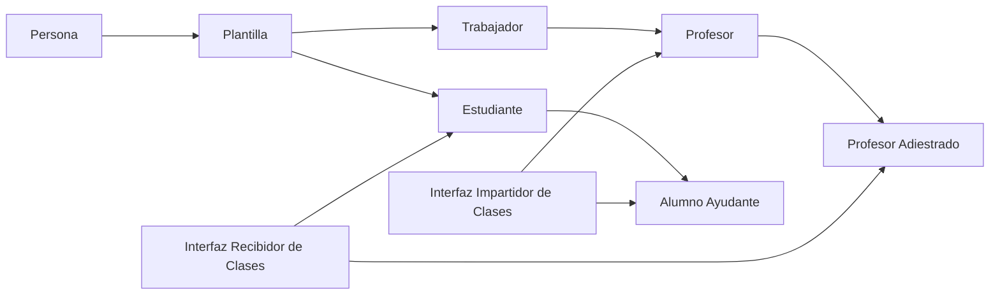
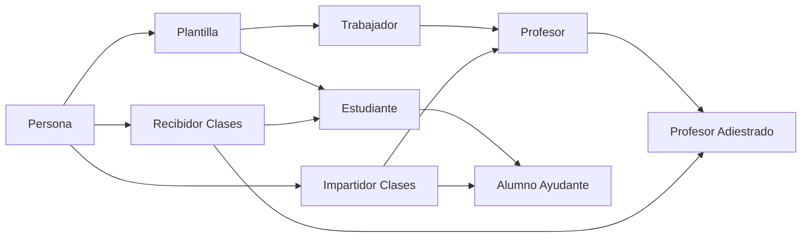
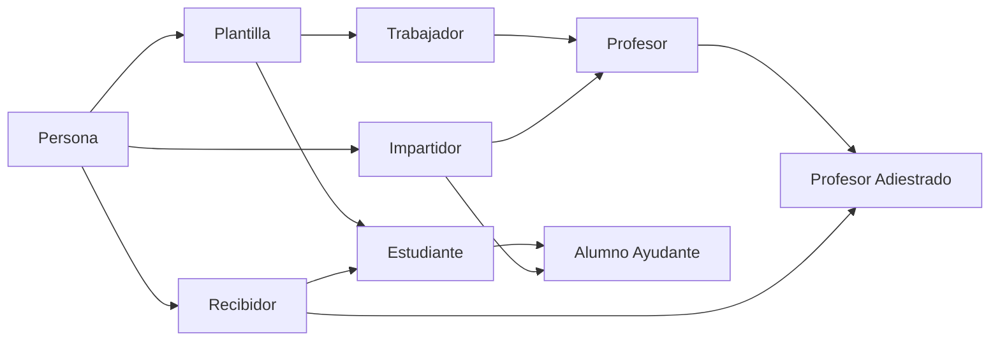
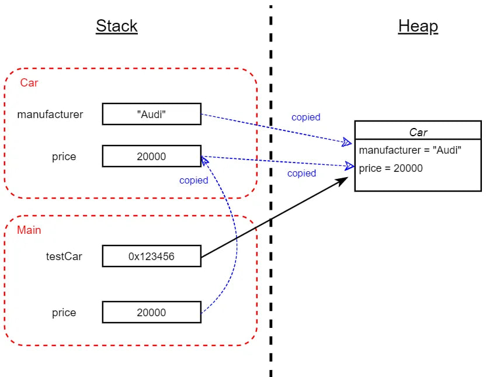
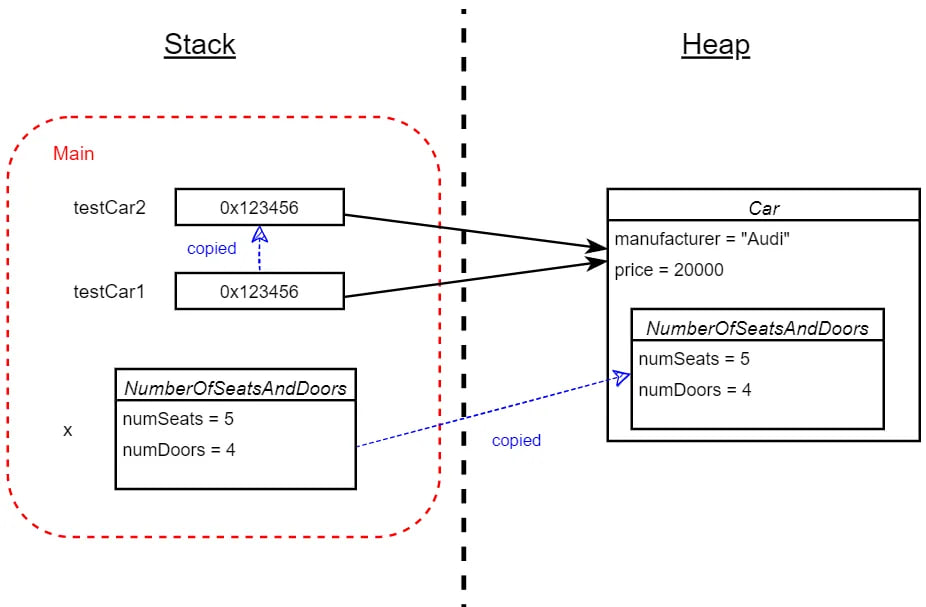

# Seminario II Herencia Múltiple

[Problema a implementar](./seminario_02_herencia.md)

## Implementación de la solución del problema

- [C#](./Csharp/Program.cs)
- [C++](./C++/main.cpp)
- [Python](./Python/main.ipynb)

## Solución propuesta en `C#`


Como en `C#` no se define la herencia múltiple, se utilizan interfaces para simular su comportamiento.
A continuación se muestra **_el diagrama de clases_** de la solución propuesta.



En una primera parte del problema tenemos que toda `Persona` se identifica por un nombre,
y que a su vez toda persona que recibe un pago es `Plantilla` de la universidad.

```csharp
 public class Persona
    {
        public string Nombre;
        public Persona(string nombre) { Nombre = nombre; }
    }

    public class Plantilla : Persona
    {
        public float Salario;
        public Plantilla(string nombre, float salario) : base(nombre)
        {
            Salario = salario;
        }
        public void CobrarSalario() => System.Console.WriteLine("Cobrar salario como plantilla");
    }

    public class Trabajador : Plantilla
    {
        public Trabajador(string nombre, float salario) : base(nombre, salario) { }
    }

```

Luego en el problema se introducen dos nuevas clases, `Estudiante` y `Trabajador`, ambas son plantilla de la universidad. Además, todo `Profesor` es un `Trabajador`. Tanto el Estudiante como el Profesor deben implementar dos funciones:`Recibir Clases`e`Impartir Clases`, respectivamente.

Inicialmente, podríamos pensar en implementar estos métodos directamente en las clases Estudiante y Profesor. Sin embargo, más adelante se introducen dos nuevas clases: `Alumno Ayudante`, que es un estudiante capaz de impartir clases, y `Profesor Adiestrado`, que es un profesor capaz de recibir clases.

Para abordar esta situación, se introduce una `interfaz` para cada uno de estos métodos.

```csharp
   public interface IRecibidorDeClases
    {
        public int HorasRecibirClase { get; set; }
        public void RecibirClase() => Console.WriteLine("Recibiendo clase");
    }

    public interface IImpartidorDeClase
    {
        public int HorasImpartirClase { get; set; }
        public void ImpartirClase() => Console.WriteLine("Impartiendo clase");
    }
```

Finalmente, se implementan las clases `Estudiante`, `Profesor`, `Alumno Ayudante` y `Profesor Adiestrado`.

```csharp
    public class Profesor : Trabajador, IImpartidorDeClase
    {
        // se tiene que reedefinir la propiedad HorasImpartirClase
        public int HorasImpartirClase { get; set; }es
        public Profesor(string nombre, float salario, int horasClase) : base(nombre, salario)
        {
            HorasImpartirClase = horasClase;
        }
    }

    public class ProfesorAdiestrado : Profesor, IRecibidorDeClases
    {
        public int HorasRecibirClase { get; set; }
        public ProfesorAdiestrado(string nombre, float salario, int horasImpartirClase, int HorasRecibirClase) : base(nombre, salario, horasImpartirClase)
        {
            this.HorasRecibirClase = HorasRecibirClase;
        }
        public void RecibirClase() => Console.WriteLine("Recibiendo clase como profesor adiestrado");

    }

    public class Estudiante : Plantilla, IRecibidorDeClases
    {
        public int HorasRecibirClase { get; set; }

        public Estudiante(string nombre, float salario, int horasRecibirClase) : base(nombre, salario)
        {
            HorasRecibirClase = horasRecibirClase;
        }

    }
    public class AlumnoAyudante : Estudiante, IImpartidorDeClase
    {
        public int HorasImpartirClase { get; set; }
        public AlumnoAyudante(string nombre, float salario, int horasRecibirClase, int horasImpartirClase)
        : base(nombre, salario, horasRecibirClase)
        {
            HorasImpartirClase = horasImpartirClase;
        }

        public void ImpartirClase() => Console.WriteLine("Impartiendo clase como alumno ayudante");
    }
```

Como podemos observar al tener las propiedades `HorasImpartirClase` y `HorasRecibirClase` en las interfaces, cada clase que implemente las interfaces `IImpartidorDeClase` e `IRecibidorDeClases` tiene que redefinir estas propiedades, lo cual puede ser un problema si se tienen que implementar muchas clases que hereden de estas interfaces o si se tiene que cambiar el nombre de estas propiedades.
(No DRY)

Por otro lado la implentación dada cumple los requisitos, veamos el siguiente ejemplo:

```csharp
        Console.WriteLine("Probemos si las clases y las interfaces están bien definidas");
        AlumnoAyudante alumnoAyudante = new AlumnoAyudante("Alumno Ayudante", 1000, 10, 5);

        Console.WriteLine("Alumno ayudante se comporta como trabajador?");
        Console.WriteLine(alumnoAyudante is Trabajador); // false

        Console.WriteLine("Alumno ayudante se comporta como profesor?");
        Console.WriteLine(alumnoAyudante is Profesor); // false

        Console.WriteLine("Alumno ayudante se comporta como estudiante?");
        Console.WriteLine(alumnoAyudante is Estudiante); // true

        Console.WriteLine("Alumno ayudante se comporta como IImpartidorDeClase?");
        Console.WriteLine(alumnoAyudante is IImpartidorDeClase); // true
```

### Escenarios en `C#`

Para no pasar por alto varios conceptos importantes de `C#` en la herencia, proponemos varios escenarios para analizar. Puede que estos escenarios no sean comunes o esten forzados, pero nos var a permitir entender.

#### Escenario 1

A la universidad se le asignó un presupuesto para contratar el transporte de los `estudiantes becados`
y `profesores afectados`.
Ambas formas de coger el transporte son diferentes.

```csharp

    interface ITransporteEstudiante
    {
        public void CogerBus() => System.Console.WriteLine("Cogiendo el bus como estudiante");
    }

    interface ITransporteProfesor
    {
        public void CogerBus() => System.Console.WriteLine("Cogiendo el bus como profesor");
    }

```

Luego de un tiempo se decide que un grupo especial de personas puedan coger ambos tipos de transporte
y se les llama `PersonalTransportado`.

```csharp
    class PersonalTransportado : ITransporteEstudiante, ITransporteProfesor
    {
        public PersonalTransportado() { }
    }
```

Ahora, ¿Qué ocurre el siguiente código?

```csharp
    PersonalTransportado personalTransportado = new PersonalTransportado();
    personalTransportado.CogerBus(); // ¿Qué imprime?
```


El código anterior no compila, ya que el método `CogerBus` es ambiguo. Esto es un ejemplo de ambigüedad en la herencia múltiple.

Pero ¿Cómo podemos solucionar estos casos? Analicemos y comparemos las distintas soluciones.

En este problema queremos conservar ambos comportamientos por separado, y queremos que `PersonalTransportado` pueda coger ambos tipos de transporte por lo que no podemos simplemente eliminar un metodo `CogerBus` de una de las interfaces. En cambio:

```tsx
    PersonalTransportado personalTransportado = new PersonalTransportado();

    ((ITransporteEstudiante)personalTransportado).CogerBus(); // Cogiendo el bus como estudiante

    ((ITransporteProfesor)personalTransportado).CogerBus(); // Cogiendo el bus como profesor
```

#### Escenario 2

A la universidad se le asignó un presupuesto para contratar seguridad debido a la llegada
de personal extranjero con malas intenciones, y robos que han ocurrido recientemente.

Los `custodios`, como es costumbre, hacen guardia, y el personal de `seguridad` puede hacer guardia como custodio o
puede hacer guardia espantando turistas como seguridad. Se quiere además que el personal de seguridad y
los custodios no se confundan pues responden a diferentes jefes.

```csharp
    interface ICustodio
    {
        public void HacerGuardia() => System.Console.WriteLine("Haciendo guardia como custodio");
    }

    interface ISeguridad
    {
        public void HacerGuardia() => System.Console.WriteLine("Haciendo guardia como seguridad");
    }
```

Ahora, podemos definir `PersonalDeSeguridad` y `Custodio` como:

```csharp
    public class Seguridad : ICustodio, ISecurity
    {
        public Seguridad() { }
        void ICustodio.Guardia() => System.Console.WriteLine("Haciendo guardia como seguridad en el puesto de custodio");
        void ISeguridad.Guardia() => System.Console.WriteLine("Haciendo guardia como seguridad");
    }

    class Custodio : ICustodio
    {
        public Custodio() { }
        void ICustodio.Guardia() => System.Console.WriteLine("Haciendo guardia como custodio");
    }
```

Una vez más, tenemos un problema de colisión de interfaces. Y esta vez, lo solucionamos haciendo uso de la implementación explícita de interfaces, la podemos usar para solucionar problemas de herencia multiple o para definir explicitamente un comportamiento como ocurre con `Custodio`. Veamos:

```tsx
        Custodio custodio = new Custodio();

        // custodio.Guardia(); // Error de compilación debido a la delaración explícita de la interfaz
        ((ICustodio)custodio).Guardia(); // Haciendo guardia como custodio

        Seguridad seguridad = new Seguridad();
        ((ICustodio)seguridad).Guardia(); // Haciendo guardia como seguridad en el puesto de custodio
        ((ISecurity)seguridad).Guardia(); // Haciendo guardia como seguridad
```

Incluso podemos usar las interfaces como tipos:

```tsx
        ICustodio custodioDelta = new Seguridad();
        custodioDelta.Guardia();
```

#### Escenario 3

A veces no sabemos de antemano qué comportamiento va a tener un método, o queremos que se pueda redefinir en el futuro por alguna razón. Para esto existe `virtual` y `override` en `C#`.

```csharp
    class A
    {
        public virtual void Metodo() => System.Console.WriteLine("Metodo de A");
    }

    class B : A
    {
        public override void Metodo() => System.Console.WriteLine("Metodo de B");
    }
```

Luego, podemos hacer:

```csharp
    A a = new A();
    a.Metodo(); // Metodo de A

    B b = new B();
    b.Metodo(); // Metodo de B

    A ab = new B();
    ab.Metodo(); // Metodo de B

    B b2 = new B();
    ((A)b2).Metodo(); // Metodo de B
```

#### Escenario 4

Podemos ocultar un método de una clase base con la palabra clave `new`.

```csharp
    class C
    {
        public void Metodo() => System.Console.WriteLine("Metodo de C");
    }

    class D : C
    {
        public new void Metodo() => System.Console.WriteLine("Metodo de D");
    }
```

Luego, podemos hacer:

```csharp
    C c = new C();
    c.Metodo(); // Metodo de C

    D d = new D();
    d.Metodo(); // Metodo de D

    C cd = new D();
    cd.Metodo(); // Metodo de C
```

Veamos que en el último caso, a diferencia de overrite en el escenario 3, el método de la clase base es llamado.

#### Escenario 5

En otros tenemos un clase que realmente no se debe materializar, pero que tiene comportamientos que queremos que se hereden.

```csharp
    abstract class E
    {
        public abstract void Metodo();
    }

    class F : E
    {
        public override void Metodo() => System.Console.WriteLine("Metodo de F");
    }
```

Este es un ejemplo de una clase abstracta. No se puede instanciar, pero se puede heredar. Y sus metodos abstractos deben ser implementados por las clases que la hereden, usando override.

### Visibilidad de miembros en `C#`

En C#, la visibilidad de un miembro de una clase se controla mediante modificadores de acceso. Los principales modificadores son public, private, protected e internal.

- public: El miembro es accesible desde cualquier parte del código.
- private: El miembro solo es accesible dentro de la propia clase.
- protected: El miembro es accesible dentro de la propia clase y sus clases derivadas.
- internal: El miembro es accesible solo dentro del mismo ensamblado.

En C#, los miembros de una interfaz son siempre públicos y no pueden tener modificadores de acceso.

## Solución propuesta en `C++`


En `C++` la herencia múltiple es soportada. A continuación se muestra `el diagrama de clases` de la solución propuesta.



A continuación se muestra la implementación de las clases en `C++`.

```cpp
    class Persona
    {
    public:
        string Nombre;
        Persona(string nombre) : Nombre(nombre) {}
    };

    class IRecibirClase : public Persona
    {
    public:
        int HorasImpartirClase;
        IRecibirClase(string nombre, int horasImpartirClase) : Persona(nombre) {}
        void RecibirClase() { cout << "Recibiendo clase" << endl; }
    };

    class IImpartirClase : public Persona
    {
    public:
        int HorasRecibirClase;
        IImpartirClase(string nombre, int horasRecibirClase) : Persona(nombre) {}
        void ImpartirClase() { cout << "Impartiendo clase" << endl; }
    };

    class Plantilla : public Persona
    {
    public:
        float Salario;
        Plantilla(string nombre, float salario) : Persona(nombre), Salario(salario) {}
        void CobrarSalario() { cout << "Cobrar salario como plantilla" << endl; }
    };

    class Trabajador : public Plantilla
    {
    public:
        Trabajador(string nombre, float salario) : Plantilla(nombre, salario) {}
    };

    class Profesor : public Trabajador, public IImpartirClase
    {
    public:
        Profesor(string nombre, float salario, int horasImpartirClase) : Trabajador(nombre, salario), IImpartirClase(nombre, horasImpartirClase) {}
    };

    class ProfesorAdiestrado : public Profesor, public IRecibirClase
    {
    public:
        ProfesorAdiestrado(string nombre, float salario, int horasImpartirClase, int horasRecibirClase) : Profesor(nombre, salario, horasImpartirClase), IRecibirClase(nombre, horasRecibirClase) {}
    };

    class Estudiante : public Plantilla, public IRecibirClase
    {
    public:
        Estudiante(string nombre, float salario, int horasRecibirClase) : Plantilla(nombre, salario), IRecibirClase(nombre, horasRecibirClase) {}
    };

    class AlumnoAyudante : public Estudiante, public IImpartirClase
    {
    public:
        AlumnoAyudante(string nombre, float salario, int horasRecibirClase, int horasImpartirClase) : Estudiante(nombre, salario, horasRecibirClase), IImpartirClase(nombre, horasImpartirClase) {}
    };
```

Como podemos observar, la implementación en `C++` es muy similar a la de `C#`. Sin embargo no pudimos ahorrar tener que repetir las propiedades HorasRecibirClase y HorasImpartirClase en cada clase derivada.

Probemos si las clases están bien definidas:

```cpp
    cout << "Probemos si las clases y las interfaces están bien definidas" << endl;
    AlumnoAyudante alumnoAyudante("Alumno Ayudante", 1000, 500, 1000);

    cout << "Alumno ayudante se comporta como estudiante?" << endl;
    cout << (dynamic_cast<Estudiante *>(&alumnoAyudante) != nullptr) << endl; // true
    {...}
```

Parece estar todo bien excepto que:

```cpp
    cout << alumnoAyudante.nombre << endl; // error de compilacion ambiguedad
```

Esto ocurre porque `AlumnoAyudante` hereda de `Estudiante` y `IImpartirClase`, y ambas tienen una propiedad `Nombre`, ya que ambos heredan de Plantilla.

### Escenarios en `C++`

Una forma de solucionar heredar miembros repetidos es hacer uso de la herencia virtual.

```cpp
    class Animal {
    public:
        virtual void eat() { std::cout << "I'm eating generic food.\n"; }
    };

    class Mammal : virtual public Animal {
    };

    class WingedAnimal : virtual public Animal {

    };

    class Bat : public Mammal, public WingedAnimal {
    };

```

Cuando ejecutamos el siguiente código:

```cpp
    Bat bat;
    bat.eat(); // I'm eating generic food.
```

Sin embargo, si hicieramos lo siguiente:

```cpp
    class Mammal : virtual public Animal {
    public:
        void eat() { std::cout << "I'm eating mammal food.\n"; }
    };
```

La salida hubiera sido `I'm eating mammal food.`

En `C++`, la ventaja de utilizar la herencia virtual es que solo se guarda una copia de los miembros heredados, evitando así problemas de ambigüedad. En el segundo caso, la salida es `I'm eating mammal food.` porque el método `eat` de la clase `Mammal` sobrescribe el método `eat` de la clase `Animal`. Sin embargo, si también hubiéramos redefinido el método `eat` en la clase `WingedAnimal`, se presentaría el mismo problema de ambigüedad.

Problemos otra forma de solucionar ambiguedades:

```cpp
    class A
    {
    public:
        A(){};
        void f() { cout << "A::f" << endl; }
    };

    class B : public A
    {
    public:
        B(){};
        void f() { cout << "B::f" << endl; }
    };

    class C : public A
    {
    public:
        C(){};
        void f() { cout << "C::f" << endl; }
    };

    class D : public B, public C
    {
    public:
        D(){};
    };
```

Si hacemos:

```cpp
    D d;
    d.B::f(); // B::f
    d.C::f(); // C::f
    // d.f(); // Error de compilación
```

Es un comportamiento similar al de `C#` con la implementación explícita de interfaces.

### Visibilidad de miembros en `C++`

En C++, la visibilidad también se controla mediante modificadores de acceso.

- public: El miembro es accesible desde cualquier parte del código.
- private: El miembro solo es accesible dentro de la propia clase.
- protected: El miembro es accesible dentro de la propia clase y sus clases derivadas.

## Solución propuesta en `Python`


Ver [notebook](./Python/main.ipynb) con la solución propuesta en `Python`.

En `Python` existe la herencia múltiple. A continuación se muestra `el diagrama de clases` de la solución propuesta.



A continuación se muestra la implementación de las clases en `Python`.

```python
    class Persona:
        def __init__(self, nombre):
            self.Nombre = nombre


    class Plantilla(Persona):
        def __init__(self, nombre, salario):
            Persona.__init__(self, nombre)
            self.Salario = salario
        def cobrar_salario(self):
            print("Cobrando salario")


    class Impartidor(Persona):
        def __init__(self, nombre, horasImpartirClase):
            Persona.__init__(self, nombre)
            self.horasImpartirClase = horasImpartirClase
        def impartir_clases(self):
            print("Impartiendo clases")


    class Recibidor(Persona):
        def __init__(self, nombre, horasRecibirClase):
            Persona.__init__(self, nombre)
            self.horasRecibirClase = horasRecibirClase

        def recibir_clases(self):
            print("Recibiendo clases")

    class Trabajador(Plantilla):
        def __init__(self, nombre, salario):
            Plantilla.__init__(self, nombre, salario)
```

En `Python` como mismo en `C++` tenemos la ventaja de que no es necesario repetir las propiedades HorasRecibirClase y HorasImpartirClase en cada clase derivada.

La función `super()` en Python se utiliza para llamar a métodos en la clase padre. En el caso de la herencia múltiple, `super()` sigue el orden definido por el método de resolución de orden de clase (MRO) y sigue escalando en los antecesores de la clase, provocando resultados inesperados. Por lo tanto, es mejor evitar el uso de `super()` en la herencia múltiple y llamar a los métodos de la clase padre directamente.

```python
    class Profesor(Trabajador, Impartidor):
        def __init__(self, nombre, salario, horasImpartirClase):
            Trabajador.__init__(self, nombre, salario)
            Impartidor.__init__(self, nombre, horasImpartirClase)
        def impartir_clases(self):
            print("Impartiendo clases como profesor")

    class ProfesorAdiestrado(Profesor, Recibidor):
        def __init__(self, nombre, salario, horasRecibirClase, horasImpartirClase):
            Profesor.__init__(self, nombre, salario, horasImpartirClase)
            Recibidor.__init__(self, nombre, horasRecibirClase)
        def calcularHorasTotales(self):
            return self.horasImpartirClase + self.horasRecibirClase


    class Estudiante(Recibidor, Plantilla):
        def __init__(self, nombre, salario, horasRecibirClase):
            Plantilla.__init__(self, nombre, salario)
            Recibidor.__init__(self, nombre, horasRecibirClase)


    class AlumnoAyudante(Estudiante, Impartidor):
        def __init__(self, nombre, salario, horasImpartirClase, horasRecibirClase):
            Estudiante.__init__(self, nombre, salario, horasRecibirClase)
            Impartidor.__init__(self, nombre, horasImpartirClase)
        def calcularHorasTotales(self):
            return self.horasImpartirClase + self.horasRecibirClase
```

Veamos qué nos permite hacer la implementación:

```python
    def testImpartirClase(profesor: Profesor):
    profesor.impartir_clases()

    def testAumentoDeHorasClase(profesor: Profesor):
        profesor.horasImpartirClase += 1000
        print(
            f"Las horas clase del profesor {profesor.Nombre} han aumentado a {profesor.horasImpartirClase}"
        )
```

Creando dos funciones para probar la consistencia de las clases, y usando el siguiente código:

```python
    profesor1 = Profesor("Profesor 1", 1000, 10)
    print(f"Nombre: {profesor1.Nombre}")
    testImpartirClase(profesor1)

    AlumnoAyudante1 = AlumnoAyudante("Alumno Ayudante 1", 1000, 10, 20)

    testImpartirClase(AlumnoAyudante1)
    trabajador = Trabajador("Trabajador 1", 1000)
    trabajador.horasImpartirClase = 10
    testAumentoDeHorasClase(trabajador) # Imprime 1010
```

Podemos comprobar que en python se trata por igual las clases y no se verifica su tipo, basta con que tenga las propiedades y métodos necesarios que se exigen en la función. Cualquier clase puede ser usada como cualquier otra sin importar su tipo.

Y seguro pensamos que al igual que en `C++` la herencia múltiple nos causará problemas de ambigüedad. Veamos:

```python
    print(f"Nombre: {AlumnoAyudante1.Nombre}") #No ocurre error de ambiguedad
```

Esto es debido a que en `Python` no hay ambigüedad en la herencia múltiple, ya que el método de resolución de orden de clase (MRO) resuelve el problema. El MRO es el orden en el que se buscan los métodos en las clases base. El MRO se calcula en tiempo de ejecución y se almacena en el atributo `__mro__` de la clase.

```python
    print(AlumnoAyudante.__mro__)
    #<class '__main__.AlumnoAyudante'>, <class '__main__.Estudiante'>, <class '__main__.Recibidor'>, <class '__main__.Plantilla'>, <class '__main__.Impartidor'>, <class '__main__.Persona'>, <class 'object'>
```

Probemos otros ejemplos:

```python

    print(
        f"Ayudante es subclase de estudiante? {issubclass(AlumnoAyudante1.__class__, Estudiante)}" # True
    )
    print(
        f"Ayudante es subclase de impartidor? {issubclass(AlumnoAyudante1.__class__, Impartidor)}" # True
    )
    print(
        f"Ayudante es subclase de trabajador? {issubclass(AlumnoAyudante1.__class__, Trabajador)}" # False
    )

    print(
        f"AlumnoAyudante1 recibe {AlumnoAyudante1.horasImpartirClase} horas clase" # 10
    )
    print(
        f"AlumnoAyudante1 imparte {AlumnoAyudante1.horasRecibirClase} horas clase"  # 20
    )
    print(
        "Calculando el total de horas clase de AlumnoAyudante1: ", AlumnoAyudante1.calcularHorasTotales() # 30
    )
```

A pesar de que `AlumnoAyudante` hereda de `Estudiante` e `Impartidor`, no hereda de `Trabajador` y aunque tenga las propiedades y métodos necesarios para ser un `Trabajador`, no lo es.

### Escenarios en `Python`

#### No solo atributos, funciones con MRO

**Escenario:** Los alumnos becados tienen asignado un **bus escolar** para ellos, y los profesores tienen asignado **otro bus**,ambos protocolos de coger el bus **son diferentes**, pero el nombre del método es el mismo. Luego de un tiempo, la dirección decide que ambos grupos de personas pueden coger **el bus que deseen**, por lo que se incluye que se herede de ambas clases

```python
    class CogerBus:
        def CogerBus(self):
            print("Cogiendo bus")

    class BusProfesores(CogerBus):
        def CogerBus(self):
            print("Cogiendo bus de profesores")

    class BusAlumnos(CogerBus):
        def CogerBus(self):
            print("Cogiendo bus de alumnos")

    class AlumnoBecado(BusAlumnos, BusProfesores):
        pass

    class ProfesorAfectado(BusProfesores, BusAlumnos):
        pass
```

Si hacemos:

```python
    alumno = AlumnoBecado()
    alumno.CogerBus() # Cogiendo bus de alumnos

    profesor = ProfesorAfectado()
    profesor.CogerBus() # Cogiendo bus de profesores
```

En este caso, el método `CogerBus` de `BusAlumnos` es llamado, ya que `AlumnoBecado` hereda de `BusAlumnos` primero. De igual forma, el método `CogerBus` de `BusProfesores` es llamado, ya que `ProfesorAfectado` hereda de `BusProfesores` primero.

#### Composición en `Python`

En python se puede hacer uso de la composición para evitar ciertos problemas que se presentan con la herencia múltiple.

```python
    class AlumnoAyudanteComposition:
        def __init__(self, nombre, salario_profesor, salario_estudiante, horasClaseRecibidas, horasClaseImpartidas):
            self.estudiante = Estudiante(nombre, salario_estudiante, horasClaseRecibidas)
            self.profesor = Profesor(nombre, salario_profesor, horasClaseImpartidas)
            self.Salario = salario_profesor + salario_estudiante

        def cobrar_salario(self):
            self.profesor.cobrar_salario()
            self.estudiante.cobrar_salario()

        def impartir_clase(self):
            self.profesor.impartir_clases()

        def recibir_clase(self):
            self.estudiante.recibir_clases()
```

Ahora tenemos un nuevo objeto que tiene comportamiento de profesor y de estudiante, y no hereda de Profesor ni de Estudiante. Puede impartir clases y a su vez recibir clases.

Lo que ocurre aqui es que `AlumnoAyudanteComposition` tiene un `Estudiante` y un `Profesor` como atributos, y delega las responsabilidades a estos objetos. De esta forma, evitamos problemas de ambigüedad y mantenemos el código limpio.

Pero igual traer ciertos problemas:

```python
    print(
        f"Ayudante es subclase de Estudiante? {issubclass(AlumnoAyudanteComposition, Estudiante)}" # False
    )
    print(
        f"Ayudante es subclase de Impartidor? {issubclass(AlumnoAyudanteComposition, Impartidor)}" # False
    )
```

Esto imprime `False` en ambos casos, ya que `AlumnoAyudanteComposition` no es subclase de `Estudiante` ni de `Impartidor`. Sin embargo, `AlumnoAyudanteComposition` tiene las propiedades y métodos necesarios para ser un `Estudiante` y un `Impartidor`. Y podría ser usado como tal.

#### Mixins en `Python`

Los mixins son clases que no se supone que se instancien, sino que se usen para agregar funcionalidades a otras clases. En `Python`, los mixins se pueden usar para simular la herencia múltiple.

```python
   class Vehicle:
    def __init__(self, name):
        self.name = name

class FlyableMixin:
    def fly(self):
        print(f"{self.name} is flying")

class Airplane(Vehicle, FlyableMixin):
    pass
```

Ahora, `Airplane` tiene el comportamiento de `Vehicle` y `FlyableMixin`. Podemos hacer:

```python
    plane = Airplane("Airplane")

    car.fly()  # Esto dará un error porque Vehicle no tiene el método fly
    plane.fly()  # Esto imprimirá "Airplane is flying"
```

### Visibilidad de miembros en `Python`

En Python, la visibilidad se controla mediante convenciones y no a través de modificadores de acceso explícitos.

- Los miembros precedidos por un guion bajo (por ejemplo, \_miembro) indican que son considerados como "privados" y no deberían ser accedidos directamente desde fuera de la clase.
- Sin embargo, esto es más una convención que una restricción y el acceso directo es posible.

```python
    class A:
        def __init__(self):
            self.__private = "Soy privado"
```

## Representación de Objetos en Memoria

## C#

Las variables de C# se almacenan en el Stack o en el Heap, dependiendo de si la variable es de tipo referencia o valor, y del contexto en el que se declara la variable.

- Las variables locales (es decir, aquellas que se declaran dentro de los métodos) se almacenan en el Stack. Esto significa que sus valores se almacenan en el Stack. En el caso de variables locales de tipo referencia, tienen referencias almacenadas en el Stack, mientras que las variables locales de tipo valor tienen valores reales almacenados en el Heap.
- Los objetos a los que apuntan las variables de tipo referencia siempre se almacenan en el Heap.
- Las variables de instancia que forman parte de una instancia de tipo referencia (por ejemplo, un campo en una clase) se almacenan en el Heap junto con el objeto mismo.
- Las variables de instancia que forman parte de una instancia de tipo valor se almacenan en el mismo contexto que la variable que declara el tipo valor. Esto significa que una variable de una estructura declarada en un método se almacenará en el Stack, mientras que una variable de una estructura declarada dentro de una clase (es decir, un campo de la clase) se almacenará en el Heap.

**Nota:** La representación exacta en memoria puede depender de la implementación específica del runtime de C# (como el Common Language Runtime - CLR). Sin embargo, podemos proporcionar una representación conceptual gráfica de cómo podrían almacenarse los datos y métodos en memoria.

### Ejemplo de una clase que no hereda de ninguna otra

```csharp
    public class Car
    {
        public string manufacturer;
        public int price;

        public Car(string manufacturer, int price)
        {
            this.manufacturer = manufacturer;
            this.price = price;
        }
    }

    static void Main(string[] args)
    {
        int price = 20000;
        Car testCar = new Car("Audi", price); 
    }
```



#### Ejemplo2

Definiremos un tipo de estructura NumberOfSeatsAndDoors y modificaremos la clase Car para que contenga un campo de este tipo.

```csharp
    public class Car
    {
        public string manufacturer;
        public int price;
        public NumberOfSeatsAndDoors numberOfSeatsAndDoors;

        public Car(string manufacturer, int price, NumberOfSeatsAndDoors numberOfSeatsAndDoors)
        {
            this.manufacturer = manufacturer;
            this.price = price;
            this.numberOfSeatsAndDoors = numberOfSeatsAndDoors;
        }
    }

    public struct NumberOfSeatsAndDoors
    {
        public int numSeats;
        public int numDoors;

        public NumberOfSeatsAndDoors(int numSeats, int numDoors)
        {
            this.numSeats = numSeats;
            this.numDoors = numDoors;
        }
    }
    class Program
    {
        static void Main(string[] args)
        {
            NumberOfSeatsAndDoors x = new NumberOfSeatsAndDoors(5, 4);
            Car testCar1 = new Car("Audi", 20000, x);
            Car testCar2 = testCar1;
        }
    }
```



#### Ejemplo3

Agregaremos un método estático a la clase Program y lo usaremos en el método. La clase Car será la del primer ejemplo para mantener las cosas simples.

```csharp
public class Car
{
    public string manufacturer;
    public int price;

    public Car(string manufacturer, int price)
    {
        this.manufacturer = manufacturer;
        this.price = price;
    }
}
class Program
{
   static void Main(string[] args)
    {
        int price = 20000;
        Car testCar = new Car("Audi", price);
        InreaseCarPrice(testCar, 5000);
    }

    static void IncreaseCarPrice(Car car, int priceIncrease)
    {
        car.price += priceIncrease;
    }
}
```


#### Ejemplo de objeto perteneciente a una clase que muestre una herencia simple

```csharp
    using System;

    // Definición de la clase base
    class Animal
    {
        public string Nombre { get; set; }

        // Constructor de la clase base
        public Animal(string nombre)
        {
            Nombre = nombre;
        }
    }

    // Definición de la clase derivada
    class Perro : Animal
    {
        public string Raza { get; set; }

        // Constructor de la clase derivada
        public Perro(string nombre, string raza) : base(nombre)
        {
            Raza = raza;
        }
    }

    class Program
    {
        static void Main()
        {
            // Crear un objeto de la clase derivada
            Perro miPerro = new Perro("Buddy", "Labrador");

            // Acceder a los miembros de la clase base
            Console.WriteLine($"Nombre: {miPerro.Nombre}");

            // Acceder a los miembros de la clase derivada
            Console.WriteLine($"Raza: {miPerro.Raza}");
        }
    }
```

En este ejemplo, la clase Perro hereda de la clase Animal. Cuando se crea un objeto de la clase Perro, en memoria, el objeto contendrá tanto los miembros de la clase Animal como los de la clase Perro. El constructor de la clase derivada (Perro) invoca el constructor de la clase base (Animal) mediante la palabra clave base. El objeto de la clase Perro tendría dos secciones de memoria: una para el miembro Nombre de la clase base (Animal) y otra para el miembro Raza de la clase derivada (Perro).


| Objeto Perro (Asignado en el Heap) |
| ------------------------------------ |
| Animal.Nombre                      |
| Perro.Raza                         |

#### Ejemplo de objeto perteneciente a una clase que utilice herencia múltiple

En C#, no se admite herencia múltiple directa de clases, pero se puede lograr mediante el uso de interfaces.

```csharp
    using System;

    // Definición de interfaces
    interface IA
    {
        void MetodoA();
    }

    interface IB
    {
        void MetodoB();
    }

    // Clase base
    class BaseClass
    {
        public void MetodoComun()
        {
            Console.WriteLine("Método común en la clase base");
        }
    }

    // Clase que implementa herencia múltiple a través de interfaces
    class MiClase : BaseClass, IA, IB
    {
        public void MetodoA()
        {
            Console.WriteLine("Implementación de IA en MiClase");
        }

        public void MetodoB()
        {
            Console.WriteLine("Implementación de IB en MiClase");
        }
    }

    class Program
    {
        static void Main()
        {
            // Crear un objeto de MiClase
            MiClase miObjeto = new MiClase();
        }
    }
```

---


| MiClase (Objeto)                             |
| ---------------------------------------------- |
| BaseClass                                    |
| - Datos y métodos específicos de BaseClass |
| IA                                           |
| - Métodos de IA                             |
| IB                                           |
| - Métodos de IB                             |

---

#### Excepciones:

**Variables estáticas**

Las variables estáticas siempre se almacenan en un heap y solo hay un bloque de heap que contiene el valor de la variable.

**Variables capturadas**

Las funciones anónimas, que incluyen expresiones lambda, complican ligeramente las cosas. Cuando se declara una función anónima que tiene acceso a las variables locales del método que las contiene, estas se denominan variables capturadas. El compilador permite esto generando una clase para contener cualquiera de las variables locales del método contenedor que utiliza la función anónima, crea una instancia de esta clase dentro del método contenedor y copia las variables locales requeridas en campos de ese objeto. El código dentro de la función anónima usa los campos de esa clase. En otras palabras, algunas variables que parecen ser variables locales (es decir, almacenadas en el Stack) de funciones anónimas son en realidad campos de un objeto que se almacena en el Stack.

**Métodos asincrónos e iteradores.**

Los métodos asincrónos retornan antes de completarse para permitir que el método continúe ejecutándose mientras ocurre algo que requiere mucho tiempo. En algún momento, los métodos asincrónos reanudan la ejecución, lo que significa que el estado dentro del método en el momento en el que regresó debe haberse conservado, aunque haya retornado. Por lo tanto, el stack frame asociado con un método asincróno no se puede desasignar de la forma descrita cuando el método vuelve a funcionar de forma asincróna; el compilador tiene que trabajar un poco para lograrlo.

Esto también se aplica a los iteradores: los iteradores y los métodos asíncronos comparten detalles de implementación similares.

# Python

Lenguajes como Python, que son de tipado dinámico y altamente abstractos, gestionan los objetos en la memoria de una manera flexible y eficiente para una amplia variedad de tareas de programación. La gestión de memoria en Python se realiza en gran medida a través de un mecanismo interno que incluye un heap privado para almacenar objetos. Aquí hay una visión general de cómo Python representa objetos en la memoria:

## Todo es un Objeto

En Python, todo se representa como un objeto, ya sea datos numéricos, secuencias, funciones o clases. Esta representación consistente simplifica el modelo del lenguaje, pero también significa que los objetos en Python pueden ser ligeramente más grandes en memoria que sus contrapartes en lenguajes de bajo nivel como C, ya que almacenan información adicional.

## Representación de Objetos

**Conteo de Referencias:** Cada objeto en Python lleva consigo al menos dos piezas de información:

- El tipo del objeto, que le dice a Python qué tipo de objeto es (por ejemplo, int, lista, clase personalizada).
- Un conteo de referencias utilizado para la gestión de memoria.

**PyObject:** En la implementación CPython (la implementación estándar de Python escrita en C), todos los objetos se representan fundamentalmente en código C como estructuras (es decir, PyObject para objetos simples o PyVarObject para objetos de tamaño variable como listas). Esta estructura contiene el conteo de referencias y un puntero al objeto de tipo correspondiente.

**Asignación de Memoria del Objeto:** Python utiliza un heap privado para asignar memoria a los objetos. La asignación y desasignación de memoria para objetos se gestiona a través del administrador de memoria interno de Python, no directamente a través del sistema operativo.

**Recolección de Basura:** Además del conteo de referencias, Python utiliza un recolector de basura que detecta ciclos generacionales para objetos que pueden hacer referencia entre sí (formando ciclos que el mecanismo de conteo de referencias no puede manejar solo). Esto afecta principalmente a estructuras de datos complejas.

## Contenedores

El manejo de contenedores en Python (como listas, diccionarios y tuplas) es una parte crucial de su representación de memoria de objetos:

- Listas y tuplas contienen referencias a otros objetos, no los objetos en sí. Esto significa que el tamaño de un objeto de lista o tupla es proporcional al número de referencias que contiene, independientemente del tamaño de los elementos.
- Los diccionarios en Python utilizan una tabla hash para almacenar claves y valores. Al igual que las listas y tuplas, el diccionario almacena referencias a claves y valores.

## Internado de Cadenas

Python emplea una técnica llamada "string interning" para un subconjunto de objetos de cadena. Esta es una optimización destinada a ahorrar memoria para cadenas que tienen el mismo contenido al reutilizarlas.

# C++

## Tipos de Valor (Asignación en el Stack)

Cuando se crea un objeto en C++ como variable local dentro de una función, generalmente se asigna en el stack. La disposición de la memoria de este objeto contiene directamente sus miembros de datos en el orden en que se declaran dentro de la clase o estructura, posiblemente ajustada por el compilador para el relleno o la alineación.

```cpp
class Ejemplo {
public:
    int x;
    double y;
};

void funcion() {
    Ejemplo obj; // obj se asigna en el stack.
}
```

## Asignación Dinámica (Asignación en el Heap)

Los objetos también pueden asignarse dinámicamente en el heap utilizando el operador `new`. Esto es útil para objetos cuya vida útil debe extenderse más allá del ámbito en el que se crean o para objetos grandes para los cuales la asignación en el stack podría no ser adecuada.

```cpp
Ejemplo* obj = new Ejemplo(); // obj se asigna en el heap.
delete obj; // La memoria debe liberarse manualmente.
```

## Diseño del Objeto

- **Clases Simples:** La disposición de la memoria de un objeto en C++ es lineal, lo que significa que sus miembros se disponen en memoria en el orden en que se declaran, aunque el compilador puede introducir relleno para fines de alineación.
- **Herencia:** En clases con herencia, generalmente se disponen primero los miembros de la clase base, seguidos por los miembros de la clase derivada. Sin embargo, los detalles exactos pueden variar con la herencia múltiple y la herencia virtual, que pueden introducir complejidad adicional en el diseño del objeto, como tablas de funciones virtuales (vtables).
- **Funciones Virtuales y Vtable:** Si una clase tiene una o más funciones virtuales, el compilador suele agregar un puntero oculto en el diseño del objeto, apuntando a una tabla de funciones virtuales (vtable) para la clase. La vtable contiene punteros a las funciones virtuales aplicables a la clase del objeto, lo que respalda el despacho dinámico (polimorfismo).
- **Alineación:** Los compiladores pueden agregar relleno entre miembros o al final de un objeto para cumplir con los requisitos de alineación, lo que puede afectar el tamaño del objeto.

**Conclusión:**
La representación de objetos en memoria en C++ es un mapeo directo de las variables miembro del objeto (y cualquier dato oculto como un puntero vtable) en bloques de memoria contiguos, ya sea en el stack o el heap. Este modelo brinda a los desarrolladores un control cercano sobre el uso y diseño de la memoria, pero también exige atención cuidadosa a las prácticas de gestión de memoria, especialmente para asignaciones dinámicas. La eficiencia y previsibilidad de este modelo son razones por las cuales C++ es preferido en programación de sistemas, desarrollo de juegos y aplicaciones donde el rendimiento y el control de memoria son críticos.
