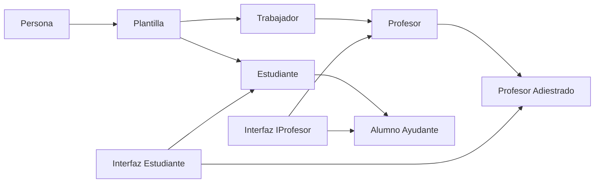

# Seminario II Herencia Múltiple

## Implementación de la solución del problema en los respectivos lenguajes

- [C#](./Csharp/Program.cs)
- [C++](./C++/main.cpp)
- [Python](./Python/main.ipynb)

## Diagrama de Clases de la Solución Csharp

[Diagrama de Clases Imagen](Frame%202608621.png)



## En qué casos la herencia múltiple puede causar ambigüedad? Ejemplifique

La herencia múltiple puede causar ambigüedad cuando una clase hereda de dos clases que tienen un método con el mismo nombre. Por ejemplo, si una clase `A` hereda de dos clases `B` y `C` y ambas clases `B` y `C` tienen un método `M`, entonces la clase `A` heredará dos métodos `M` con el mismo nombre.
En la soluciones propuestas propusimos un escenario y como actúa cada lenguaje en este caso.

Ejemplo:

```csharp
class B
{
    public void M()
    {
        Console.WriteLine("M de B");
    }
}

class C
{
    public void M()
    {
        Console.WriteLine("M de C");
    }
}

class A : B, C
{
    public void Test()
    {
        M(); // ¿Cuál método M se llama?
    }
}

```

## ¿Cómo podemos solucionar estos casos? Analice y compare las distintas soluciones. ¿Cuál es la solución propuesta en `C#`?

En [C#](./Csharp/Program.cs) propusimos varios ejemplos de soluciones a la ambigüedad de la herencia múltiple. Algunas de las soluciones propuestas son:

- **Renombrar los métodos**: Cambiar el nombre de los métodos para que no haya ambigüedad.
- **Usar la declaración explícita de la interfaz**: En C# se puede implementar una interfaz de forma explícita, lo que permite que una clase implemente dos métodos con el mismo nombre, pero que pertenecen a dos interfaces diferentes.
- **Reescribir el método**: En C# se puede reescribir un método para que tenga un comportamiento diferente en la clase derivada.

## Explique cómo se representan los objetos en memoria. Ponga un ejemplo de:

### Un objeto perteneciente a una clase que no herede de ninguna otra

TODO
